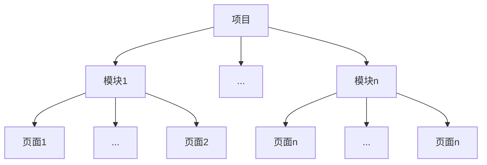
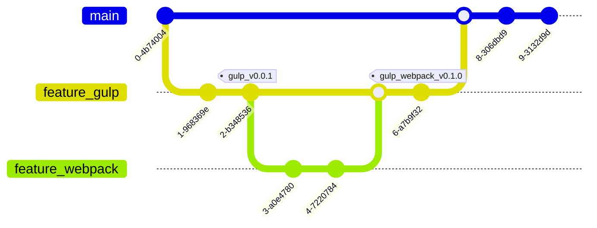

<!-- layout: default, intro, section, items(cols), quote, fact, statement -->

# 做一个合格的前端性能开发者

<div text-center>
  <carbon-user-avatar text-red-400 /><span ml-2 text-orange-500>山枫</span>
</div>
<!-- animate-bounce -->

<!-- 大家好，我是一位前端爱好者，也是一位有着五年经验的前端开发者。今天我想分享的主题是：做一个合格的前端性能开发者。在分享写稿之前，我自己也总结了一下这五年来做的项目以及遇到的一些问题，希望大家今天能从中吸取一些经验，在以后的开发过程中避免遇到一些问题 -->

<!-- 性能优化：性能 优化 -->

---

# 思考

试着回顾一下你之前的项目

<!-- 带着问题思考一下 -->

- 性能优化是什么

代码优化、系统优化、效率提升

- 是否遇到性能问题

- 如何解决性能问题

- 优化的结果是什么

- 是否有产出工具

- 得到的响应如何

---
layout: cover
---

# <carbon-data-share text-red-400 />

<!-- animate-flash -->
<div text-6xl text-orange-400 text-center>开始分享之旅</div>

---

# 分享纲要

<!-- 今天我会带着以下几点进行分享 -->

<!-- <v-clicks> -->

- [性能优化的原因](.)
- [性能优化的衡量](.)
- [性能优化的工具](.)
- [性能优化的实施](.)
  - [性能预算](.)
  - [性能演练](.)
- [性能优化的案例](.)
- [总结](.)
- [Q/A](.)

<!-- </v-clicks> -->

---

# 性能优化的原因

- 留住用户
- 用户体验
- 转化率
- 开发体验
- 开发维护
- 持久性

---
layout: two-cols
---

# 性能优化的衡量

<!-- 你的项目是否需要极致的优化性能，针对的人群，项目的访问量 -->

<!-- 
PRPL 渐进式的网页模型
- push 将关键的资源推送给用户
- render 尽可能快的渲染页面
- precache 使用缓存
- lazy-load 使用懒加载

RAIL 以用户为中心的性能模型
> 0 - 16ms 每秒渲染60帧（越快的时间渲染更多的帧越好）
> 0 - 100ms 结果即时呈现
> 100 - 1000ms 结果基本是自然连续
> <= 1000ms 用户的注意力会转移
> > 1000ms 用户会离开页面，体验性很差

- response 50ms - 100ms 内响应事件
- animation 10ms内生成一帧，流畅的视觉效果
- idle 最大限度增加空闲时间，利用空闲时间加载其他数据
- load 5s 内交付内容并实现可交互

layout shift score（可视区域大小和两个已渲染帧之间的可视区域不稳定元素的位移） = impact fraction（不稳定元素对两帧之间的可视区域产生的影响） * distance fraction（不稳定元素在一帧中位移的最大距离/可视区域的最大尺寸纬度）

-->

<div text-2xl text-orange-400>两个模型</div>

- PRPL
  - Push 将关键的资源推送给用户
  - Render 尽可能快的渲染页面
  - Precache 使用缓存
  - Lazy-load 使用懒加载
- RAIL
  - Response 50ms - 100ms 内响应事件
  - Animation 10ms 内生成一帧，流畅的视觉效果
  - Idle 最大限度增加空闲时间（加载其他数据）
  - Load 5s 内交付内容并实现可交互

::right::

<div text-2xl text-orange-400>多个指标</div>

- LCP（Largest Content Paint）
  - 😀 <= 2.5s
  - 🙃 > 4s
- FID（First Input Delay）
  - 😀 <= 300ms
  - 🙃 > 600ms
- CLS（Cumulative Layout Shift）
  - 😀 <= 0.1
  - 🙃 > 0.25
- TBT（Total Blocking Time）
  - 😀 <= 300ms
  - 🙃 > 600ms
- ...

---

# 性能优化的工具

- Chrome Devtool
  - Performance
  - Lighthouse
  - Performance insights
- [PageSpeed Insights](https://pagespeed.web.dev)
- [Web Vitals](https://github.com/GoogleChrome/web-vitals)
- 自定义工具
- [Puppeteer](https://pptr.dev/)

---

# [PageSpeed Insights](https://pagespeed.web.dev)

[以下是通过 PageSpeed Insights 测试 Vue 官网得到的数据](https://pagespeed.web.dev/analysis/https-cn-vuejs-org/5pjw5ehjps?form_factor=desktop)


---

# [PageSpeed Insights](https://pagespeed.web.dev)

[以下是通过 PageSpeed Insights 测试 Vue 官网得到的数据](https://pagespeed.web.dev/analysis/https-cn-vuejs-org/5pjw5ehjps?form_factor=desktop)


---

# [Web Vitals]((https://github.com/GoogleChrome/web-vitals))

[手动收集各种指标 Web Vitals](https://github.com/GoogleChrome/web-vitals)

<!-- 
INP interaction to next paint

TTFB
- reduce server response times
- DNS lookup, connection negotiation, network latency, server processing time
-->

```js
import { onLCP, onCLS, onFID, onINP, onFCP, onTTFB } from 'web-vitals';

// largest content paint
onLCP(console.log);
// cumulative layout shift
onCLS(console.log);
// first input delay
onFID(console.log);
// interaction to next paint
onINP(console.log);
// first content paint
onFCP(console.log);
// time to first byte
onTTFB(console.log);
```

---

<!-- 
知识点
1. DOMHihgResTimeStamp 一个存储系统级别的毫秒数（微秒 毫秒）
2. performance.now() 不受时钟调整、时钟倾斜的影响，精确到微秒级别的浮点数（系统）
3. performance.timeOrigin 文档上下文创建的开始时间
 -->

# [Performance API](https://developer.mozilla.org/en-US/docs/Web/API/Performance_API)

- [PerformanceObserver](https://developer.mozilla.org/en-US/docs/Web/API/PerformanceObserver)
  - observe
  - takeRecords
  - disconnect
- Performance[Element|Event|Longtask|Mark|Measure|Navigation|Paint|Resource|Server]Timing
- ...

<!--
support entry types

- element
- event
- first-input
- largest-contentful-paint
- layout-shift 
- longtask 
- mark
- measure
- navigation
- paint
- resource

observe options parameters

- buffered 缓冲区
- durationThreshold 延迟阈值
- entryTypes[]
- type
-->

```js
const perfObserver = new PerformanceObserver((list) => {
  list.getEntries().forEach(entries => {/* metrics */})
});
perfObserver.observe({ type: 'element|event|fisrt-input|largest-contentful-paint|layout-shift|···', buffered: true });
// perfObserver.disconnect();
```

---

# [Puppeteer](https://pptr.dev/)

<!-- playwright -->

- 生成快照和 PDF
- 抓取网页内容预渲染
- 自动化提交测试（键盘输入）
- 测试浏览器对 JavaScript 特性的兼容性
- 捕捉控制台分析性能
- 测试扩展程序

---

# 性能优化的实施

优化产生 -> 优化开始 -> 优化过程 -> 优化结果

## 实施 - 性能预算

- 领导层面
  - 评估
  - 必要性
- 团队
  - 增加负担
  - 影响节奏
  - 绩效评估

---

# 实施 - 性能演练

调研目前技术社区普遍的优化方式

- 时间角度
  - 首屏加载
  - 网络请求
  - 渲染
  - 计算
- 空间角度
  - 内存
  - 缓存

---

# 时间角度 - 首屏加载

页面尽可能快的展示给用户看，减少白屏时间

- 服务端（SSR）渲染，减少二次请求和渲染的耗时
- 优先获取加载首屏关键资源，按需加载（Dynamic import、Tree shaking）
- 图片或者视频资源（预览显示、懒加载）
- 离线缓存，用于下一次的页面快速渲染（Service Worker）

---

#  时间角度 - 网络请求

- 合理使用 CDN，减少网络请求耗时
- 使用 HTTP2/3（服务端推送、请求优先级、二进制帧）
- Resources Hints(prefetch preload prerender dns-prefetch modulepreload preconnect)
- 对资源进行压缩，减少传输数据大小
- 请求资源合理的拆分，减少请求资源的体积
- 对请求进行优化（请求合并、域名分片）

---

#  时间角度 - 渲染

1. 减少 DOM 数量、减少/合并 DOM 操作，减少浏览器渲染过程中的计算耗时
2. 合理使用浏览器 GPU 进程（重绘 回流），提升浏览器渲染效率
3. 将浏览器帧率保持在 60FPS，提升页面交互和渲染的流畅度（RequestAnimation）
4. 预加载资源，空闲时间获取加载需要用到的资源


---

#  时间角度 - 计算

- 缓存结果
- 使用更优的算法和数据结构，提升计算效率
- 使用更高运行效率的方式（Webassembly）
- 将任务进行拆解并行，降低整体耗时，减轻主线程压力（Web Worker）

---

# 空间角度

1. 合理使用缓存（LocalStorage, IndexDB），及时清理
2. 尽可能复用对象，减少对象的创建，减少内存占用
3. 尽可能少的使用闭包、全局变量，避免内存泄漏
4. 避免复杂/异常的递归调用，防止栈溢出

---

# 性能优化的案例

<!--
- [Immutable JS](https://immutable-js.com/)
- [Rx JS](https://rxjs.dev/)
-->

- [编码](.)
  - 技术栈选型
  - 减少依赖
  - Code Review
  - 提升效率
- [Puppeteer](.)
- [大量数据的处理](.)
  - 虚拟列表
  - Excel 合并
- [历史项目的构建演进](.)
  - 优化
  - 结果
  - 未来

---

# 案例 - 编码

项目以 Vue 技术栈为主（Write Less, Do More）

<div grid grid-cols-2 gap-10>
  <TabList title="技术栈" :list="['Vue2/Vue3', 'Vue-cli/Vite/Nuxt.js/小程序', '自主搭建']" />
  <TabList title="减少依赖" :list="['择优引入（Rxjs Lodash）', '引入其他依赖库的必要性']" />
  <TabList title="Code Review" :list="['针对工具类/方法测试', '组件的规范性', 'Vueuse（hooks）', '原子 CSS']" />
  <TabList title="工具" :list="['低代码']" />
</div>

---
layout: two-cols
---

# 案例 - [Puppeteer](https://pptr.dev/)

<!-- Playwright -->
项目利用 Puppeteer 能做什么

- 处理 P0 级故障
  - 页面白屏
- 检测页面性能指标
  - Metrics
- 自动化测试
  - 关键页面表单测试
- 接口测试
  - HTTPRequest
  - HTTPResponse
- 预警上报
  - 钉钉

::right::

```js
import puppeteer from 'puppeteer';

(async () => {
  const browser = await puppeteer.launch({ headless: false });
  const page = await browser.newPage();

  await page.setViewport({ width: 1440, height: 900 });
  await page.goto("https://erp.xx.xx/login");

  // login
  await page.type("#login-company", "xx");
  await page.type("#login-account", "xx");
  await page.type("#login-password", "xx");
  await page.click("#login-btn");

  page.on("console|pageerror|metrics|request|response", function (result) {
    // handle result
  });

  await page.waitForNavigation();
  await page.waitForNetworkIdle();
  
  // screenshot
  await page.pdf({ path: `./__screenshots__/${Date.now()}.pdf` });
  await page.screenshot({ path: `./__screenshots__/${Date.now()}.png` });
  await browser.close();
})();
```

---

# 案例 - 大数据的处理（一）

<div text-orange-400 text-2xl>虚拟列表</div>

**以虚拟表格为主**

- 横向
- 竖向
- 高度固定/动态高度
- 表格复杂性
  - 展开
  - 单元格组件的多样性（输入框、选择框）
  - 单元格双向绑定数据
  - 搜索

---
layout: two-cols
---

# 案例 - 大数据的处理（二）

<!-- <h1><carbon-websheet text-red-400 /></h1> -->
<div text-orange-400 text-2xl>Excel 文件合并</div>

**多个文件组合成一个文件输出，并支持链接转图片**

- 分片处理
  - 数据切片
- 进度条处理
- 图片压缩
  - Compressor
- 分批请求
  - 引入 Web Worker
- 批次输出

::right::

```js
// 伪代码
import ExcelJS from 'exceljs';

// fileList to array buffer
const workbook = new ExcelJS.Workbook();
await workbook.xlsx.load(buffer);

// worker
const worker = new Worker('xxxx');
worker.onmessage = function onmessage(event) {/* 写入图片 */}

let total = 1e6, sheet = 1e5;
let steps = Math.ceil(total / sheet);

for (let step = 0; step < steps; step += 1) {
  // 分片 & 进度条处理
  for (let rowIdx = ?; rowIdx < ?; rowIdx++) {
    for (let colIdx = ?; colIdx < ?; colIdx++) {
      // 图片处理 压缩
      worker.postMessage({ rowIdex, colIdex, url});
      // 其他数据处理
    }
  }
}
// write 批次输出
await workbook.xlsx.writeBuffer();
```

---

# 案例 - 历史项目的演进

项目背景

<!-- 微前端/Module Federation -->

- 技术栈 jQuery + Vue（字符串模板）
- 项目页面 300+
- 项目模块 15+
- 构建工具 Gulp
- 模块之间相互依赖

```js
// window Vue
const vm = new Vue({
  template: '<div>{{ msg }}</div>',
  data() {
    return {
      msg: 'Hello World',
    };
  },
}).$mount();
// render
document.getElementById('root').appendChild(vm.$el);
```

<!-- 部分重构 -->

<div absolute top-10 right-0 h80 w160>

</div>

---
layout: cover
---

# <carbon-retry-failed text-orange-400 />



---

# <carbon-restart text-orange-400 />
<!-- 构建工具的结果 -->

<div flex mb-10 text-4>
  <Badge text-blue-100 title="模块化"></Badge>
  <Badge text-blue-200 title=".vue 模板开发"></Badge>
  <Badge text-blue-300 title="vue jsx 开发"></Badge>
  <Badge text-blue-400 title="热更新"></Badge>
  <Badge text-blue-500 title="热重载"></Badge>
  <Badge text-orange-400 title="Tree Shaking"></Badge>
  <Badge text-orange-500 title="Dynamic Import"></Badge>
</div>

- 微前端
  - 独立的模块拆分出来（互不依赖/依赖小）
- ESbuild
  - Less
- Webpack
  - dependOn 拆分公共文件
  - splitChunks 拆分公共依赖（精细配置）

---

# <carbon-restart text-orange-400 />

```js
module.exports = {
  entry: {
    common1: { import: './src/common1.js' },
    module1: { import: './src/module1.js', dependOn: 'common1' },
    // ...
  },

  optimization: {
    splitChunks: {
      chunks: 'all|async|function|regexp',
      name: 'default',
      // minSize: 0,
      // 自定义
      cacheGroups: {
        vueVendors: {
          test: /[\\/]node_modules[\\/](vue(\.js)?)[\\/]/,
          name: 'vue-vendors',
          chunks: 'all',
          // enforce: true, // boolean
        },
      },
    },
  },
};
```

---
layout: cover
---

# <carbon-pause-future text-orange-400 />

Native 语言编译的时代（Rust, Zig...）

- 插件的升级
- 构建工具的再优化
  - Turbopack/Rspack

---

# 总结

<!-- 回到我们分享的标题，如何做一个合格的性能开发者，我觉得应该做到以下几点 -->

**性能优化不仅仅是一些指标的体现，项目启动开发到上线维护的整条链路上都存在优化的点**

- 提升编码能力
- 分析性能
- 提出、找出性能问题
- 解决存在的性能问题（落地）
- 结果导向
- 总结
- 推广

---
layout: two-cols
---

# Thanks

<div text-8xl flex justify-center items-center h-full>Q/A</div>

::right::

<div text-4xl flex justify-center items-center h-full>
  <carbon-logo-wechat text-green-400 />
  <p ml-2>lydfeng1995</p>
</div>
